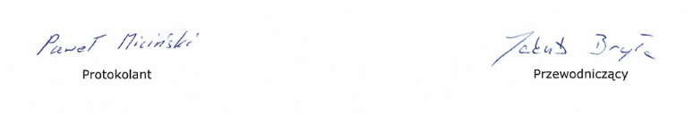

<h1 align="center">
REGULAMIN 
Studenckiego Koła Naukowego 
AGH Rapid Prototyping 
Akademii Górniczo-Hutniczej 
im. Stanisława Staszica w Krakowie

</h1>

## §1. Postanowienia ogólne

1. Koło Naukowe pod nazwą _AGH Rapid Prototyping_, jest uczelnianą organizacją studencką, w rozumieniu art. 111 ustawy z dnia 20 lipca 2018 r. [— _Prawo o szkolnictwie wyższym i nauce_](https://www.gov.pl/documents/1068557/1069061/ustawa_Prawo_o_szkolnictwie_wy%C5%BCszym_i_nauce_DzU_30082018.pdf/91bcb704-5009-98ae-6fe9-ee3f1cd86688).
2. Koło zrzesza wyłącznie studentów [Akademii Górniczo-Hutniczej im. Stanisława
   Staszica w Krakowie](https://agh.edu.pl), zwanej dalej **Uczelnią**.
3. Siedzibą Koła jest [Wydział Inżynierii Mechanicznej i Robotyki](https://imir.agh.edu.pl).
4. Koło może posługiwać się logo AGH.

## §2. Cele i zadania Koła

1. Podstawowym celem Koła jest rozbudzanie zainteresowań pracą naukową,
   badawczą w zakresie technologii szybkiego prototypowania.
2. Celami Koła są w szczególności:
   1. Rozwój nowoczesnych rozwiązań mechatronicznych w zakresie technologii
      szybkiego prototypowania, w szczególności metod przyrostowych;
   2. Rozwój zaawansowanego oprogramowania do konwersji modeli 3D do
      postaci kodu maszynowego, zwanego dalej slicerem;
   3. Rozwój metod do analizy jakości elementów wytworzonych metodami
      przyrostowymi;
   4. Reprezentacja uczelni na wydarzeniach i sympozjach związanych z branżą
      szybkiego prototypowania;
   5. Umożliwienie studentom realizację założonych projektów z zakresu
      szybkiego prototypowania.
3. Cele, o których mowa w [ust. 2](#2-2) będą realizowane poprzez:
   1. prowadzenie pod kierunkiem Opiekuna Naukowego badań naukowych;
   2. organizowanie sesji naukowych;
   3. organizowanie warsztatów, spotkań;
   4. udziału w konferencjach branżowych.
4. Do realizacji celów, o których mowa w niniejszym paragrafie, Koło korzysta ze
   środków materialnych przekazanych przez Uczelnię oraz inne podmioty - za
   pośrednictwem Uczelni.

## §3. Członkostwo

1. Członkiem Koła może zostać student Uczelni, wykazujący zainteresowania
   naukowe w zakresie informatyki, automatyki, robotyki, elektroniki, mechatroniki, technik wytwarzania, nauki o materiałach i innych nauk pokrewnych, osiągający dobre wyniki w nauce, identyfikujący się z celami Koła i wyrażający chęć ich realizacji.
2. Studenta deklarującego chęć członkostwa, w poczet członków Koła przyjmuje Zarząd na podstawie pisemnej deklaracji złożonej przez studenta. Warunkiem pozytywnego rozpatrzenia wniosku jest spełnianie warunków, o których mowa w [ust. 1.](#3-1)
3. Wskazując w deklaracji członkowskiej swój adres e-mail student wyraża zgodę na otrzymywanie drogą elektroniczną wszelkich informacji przesyłanych przez Zarząd, dotyczących zarówno spraw indywidualnych, jak i innych informacji o
   charakterze organizacyjnym.
4. Członek Koła ma prawo:
   1. udziału we wszelkich formach działalności Koła;
   2. zgłaszania wniosków i propozycji w czasie zebrań Koła;
   3. dokonywania oceny działalności Zarządu Koła;
   4. korzystania z czynnego i biernego prawa wyborczego.
5. Członek Koła ma obowiązek:
   1. wykazywać się dobrymi wynikami w nauce;
   2. regularnie brać udział w zebraniach Koła;
   3. aktywnie uczestniczyć w pracach Koła;
   4. stosować się do postanowień organów Koła;
   5. przestrzegać postanowień niniejszego Regulaminu.
6. Członkostwo w Kole ustaje na skutek:
   1. dobrowolnej rezygnacji członka, przedłożonej Zarządowi Koła w formie pisemnej;
   2. utraty przez członka Koła statusu studenta Uczelni;
   3. wykluczenia członka w drodze uchwały Zarządu Koła, w przypadku zaistnienia okoliczności, o których mowa w [ust. 7](#3-7);
   4. rozwiązania Koła.
7. Zarząd Koła może wykluczyć członka z następujących powodów:
   1. świadomego działania na szkodę Koła;
   2. nieprzestrzegania postanowień niniejszego Regulaminu;
   3. rażącego niewywiązywania się z podjętych wobec Koła zobowiązań;
   4. nieusprawiedliwionej nieobecności na dwóch zebraniach Koła w ciągu roku akademickiego.
8. O podjęciu uchwały w sprawie wykluczenia Zarząd Koła informuje wykluczonego
   członka w formie pisemnej wraz z uzasadnieniem i pouczeniem o przysługującej
   mu drodze odwoławczej.
9. Od uchwały Zarządu w sprawie wykluczenia, wykluczonemu członkowi przysługuje prawo złożenia odwołania do Walnego Zebrania Członków Koła. Odwołanie składa się za pośrednictwem Zarządu w terminie 14 dni od daty otrzymania przez wykluczonego członka pisemnej informacji o wykluczeniu.
10. Po otrzymaniu odwołania i jego rozpatrzeniu Zarząd, jeśli uzna, że odwołanie zasługuje w całości na uwzględnienie, może uchylić swoją uchwałę w sprawie wykluczenia i przywrócić studenta w prawach członka Koła, o czym student jest informowany w formie pisemnej.
11. W razie wniesienia przez wykluczonego członka Koła odwołania i nieuwzględnieniu przez Zarząd tego odwołania w trybie określonym w [ust. 10](#3-10), Zarząd Koła jest obowiązany zwołać Nadzwyczajne Walne Zebranie Członków Koła najpóźniej w terminie 30 dni od daty otrzymania odwołania. Obowiązku tego Zarząd nie musi spełnić, jeżeli w terminie 30 dni od daty otrzymania odwołania ma się odbyć Zwyczajne Walne Zebranie Członków Koła.
12. Walne Zebranie Członków Koła po rozpatrzeniu odwołania może podtrzymać bądź uchylić uchwałę Zarządu w sprawie wykluczenia członka Koła. Uchwała Walnego Zebrania Członków Koła jest podejmowana większością 2/3 głosów przy obecności co najmniej połowy Członków Koła.

## §4. Walne zebranie członków Koła

1. Walne Zebranie Członków jest najwyższą władzą Koła.
2. Do kompetencji Walnego Zebrania Członków Koła należy w szczególności:
   1. określanie kierunków działalności Koła;
   2. decydowanie o strukturze organizacyjnej Koła;
   3. wybór członków Zarządu Koła;
   4. rozpatrywanie odwołania od uchwały Zarządu w sprawie wykluczenia członka Koła oraz podejmowanie uchwały podtrzymującej lub uchylającej uchwałę Zarządu w sprawie wykluczenia członka;
   5. rozpatrywanie wniosków i propozycji zgłaszanych przez Zarząd i poszczególnych członków Koła;
   6. zatwierdzanie przedkładanego przez Zarząd pisemnego sprawozdania z działalności Koła w poprzednim roku akademickim, w tym z wykorzystania otrzymanych Środków;
   7. zatwierdzanie preliminarza rocznego działalności Koła;
   8. uchwalanie zmian Regulaminu Koła;
   9. podejmowanie uchwały w sprawie rozwiązania Koła;
   10. podejmowanie uchwał w sprawie środków materialnych pozostających w dyspozycji Koła w razie jego rozwiązania.
3. W Walnym Zebraniu Członków Koła mają prawo uczestniczyć wszyscy członkowie Koła.
4. Zwyczajne Walne Zebranie Członków Koła odbywa się co najmniej raz w semestrze, przy czym w semestrze zimowym musi się ono odbyć nie później niż do 15 listopada.
5. W razie potrzeby, w szczególności w przypadkach, o których mowa w [§3 ust. 11](#3-11), jest zwoływane Nadzwyczajne Walne Zebranie Członków Koła.
6. Walne zebranie członków Koła zwołuje Zarząd z własnej inicjatywy, na wniosek 30% członków Koła lub na wniosek Opiekuna Naukowego Koła.
7. O terminie, miejscu i proponowanym porządku obrad Walnego Zebrania Zarząd informuje wszystkich członków Koła z co najmniej 7-dniowym wyprzedzeniem. O Walnym Zebraniu Członków Koła Zarząd każdorazowo powiadamia Opiekuna Naukowego Koła.
8. Walne Zebranie Członków Koła jest zdolne do podejmowania ważnych uchwał, jeżeli uczestniczy w nim co najmniej połowa aktualnej liczby członków Koła.
9. Jeżeli kworum, o którym mowa w [ust. 8](#4-8), nie zostanie osiągnięte w pierwszym terminie, Zarząd zwołuje Walne Zebranie Członków Koła w drugim terminie, z zachowaniem trybu określonego w [ust. 7](#4-7) Uchwały podjęte podczas zebrania zwołanego w drugim terminie są ważne bez względu na liczbę członków uczestniczących w Walnym Zebraniu, chyba że niniejszy Regulamin dla ważności poszczególnych uchwał wymaga obecności co najmniej połowy liczby członków Koła.
10. Uchwały na Walnym Zebraniu Członków Koła są podejmowane zwykłą większością głosów, za wyjątkiem uchwał określonych w niniejszym Regulaminie, a wymagających innej większości.

## §5. Zarząd

1. Zarząd jest wybierany przez Walne Zebranie spośród członków Koła. Uchwały w sprawie wyboru Zarządu są podejmowane w głosowaniu tajnym bezwzględną większością głosów,
2. Zarząd Koła składa się z trzech osób, które spośród swego grona wybierają Przewodniczącego, kierującego pracami Zarządu i reprezentującego go na zewnątrz.
   > Walne zebranie członków Koła może ustalić inną liczbę członków Zarządu.
3. Dokumenty w imieniu Koła podpisuje Przewodniczący lub z jego upoważnienia członek Zarządu.
4. Kadencja Zarządu trwa jeden rok akademicki.
   > Walne Rbranie członków Koła może ustalić dłuższą kadencję Zarządu.
5. Uchwały Zarządu są podejmowane zwykłą większością głosów.
6. Zarząd jest organem wykonawczym Koła.
7. Do kompetencji Zarządu należy w szczególności:
   reprezentowanie Koła wobec Władz Uczelni oraz na zewnątrz;
   1. kierowanie działalnością Koła;
   2. sporządzanie preliminarza rocznego działalności Koła;
   3. sporządzanie pisemnego sprawozdania z działalności Koła w poprzednim roku akademickim, w tym z wykorzystania otrzymanych Środków;
   4. rozpatrywanie deklaracji członkowskich oraz podejmowanie uchwał w sprawie nabycia i utraty członkostwa w Kole;
   5. zwoływanie Walnego Zebrania Członków Koła w trybie określonym w niniejszym Regulaminie;
   6. podejmowanie decyzji we wszystkich sprawach związanych działalnością Koła, niezastrzeżonych dla Walnego Zebrania Członków Koła.
8. Ustępujący Zarząd jest obowiązany przedłożyć Walnemu Zebraniu Członków Koła do zatwierdzenia sprawozdanie z działalności Koła w poprzednim roku kalendarzowym, w tym z wykorzystania otrzymanych środków.
9. Na wniosek co najmniej 30% członków Koła Zarząd lub poszczególni jego członkowie mogą zostać przez Walne Zebranie Członków Koła odwołani w czasie trwania kadencji większością 2/3 głosów przy obecności co najmniej połowy liczby członków Koła.
10. Wybór nowego Zarządu lub uzupełnienie jego składu odbywa się w trybie określonym w [ust. 1](#5-1).
11. Nowy zarząd ma obowiązek pisemnego zawiadomienia Prorektora AGH właściwego do spraw studenckich o dokonanej zmianie składu osobowego Zarządu w terminie 14 dni od dnia dokonania zmiany. Do zawiadomienia dołącza się kopię uchwały Walnego Zebrania Członków Koła, na podstawie której dokonano zmiany.

## §6. Opiekun Naukowy Koła

1. Opiekunem Naukowym Koła może zostać pracownik dydaktyczny, badawczy lub badawczo-dydaktyczny AGH, o ile wyrazi pisemną zgodę na pełnienie tej funkcji i uzyska zgodę Dziekana Wydziału.
2. Opiekun naukowy sprawuje opiekę nad działalnością merytoryczną Koła.
3. Na wniosek 2/3 członków Koła Naukowego, Zarząd ma prawo wystąpić do Dziekana o zmianę Opiekuna, Wniosek o zmianę Opiekuna należy złożyć za pośrednictwem odpowiedniego Pełnomocnika Rektora ds. Kół Naukowych, który opiniuje wniosek i przedkłada Dziekanowi Wydziału. We wniosku należy wskazać kandydata na nowego Opiekuna Naukowego Koła.

## §7. Postanowienia Końcowe

1. Zmiana Regulaminu wymaga uchwały Walnego Zebrania Członków Koła podjętej większością 2/3 głosów przy obecności co najmniej połowy liczby członków Koła.
2. Zarząd Koła Naukowego ma obowiązek pisemnego zawiadamiania Prorektora AGH właściwego do spraw studenckich o każdej zmianie treści niniejszego Regulaminu oraz każdej uchwale Walnego Zebrania Członków Koła, w terminie 14 dni od dnia dokonania zmiany.
3. Walne Zebranie Członków Koła większością 2/3 głosów przy obecności co najmniej połowy liczby członków Koła może podjąć uchwałę w sprawie zawieszenia działalności, lub rozwiązania Koła,
4. Niniejszy Regulamin wchodzi w życie z dniem 24.02.2024

